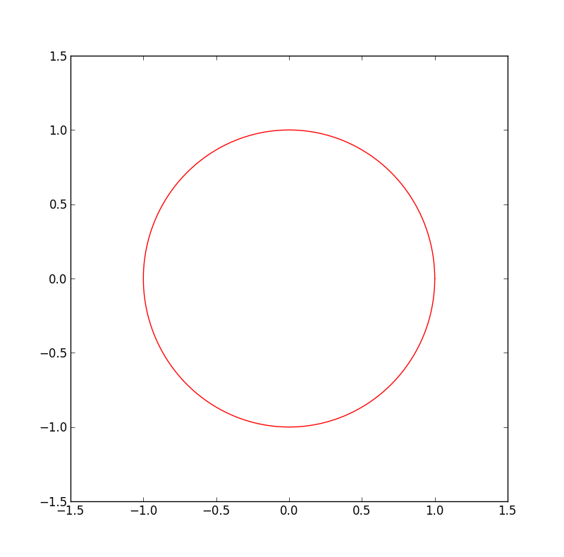
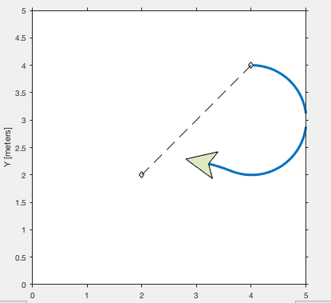

# Intelligent Robot Homework 1

#### Yuxing Hu 11510225

---

## 1. Discuss the advantages and limits of different wheel drives

### Differential Drive

**Advantages** 

Simplicity. Differential drive system is very sample, and the wheels in the most of the time is directly connected to the moter.

**Limits**

Very hard to control. It’s very difficult for differential drive robot to keep straight, because each wheel is separately controlled. And if the speed of each wheel is not precisely equal,

### Ackerman Drive

**Advantages**

Easy to simulate, and the geometry is simple.Effectively stop the slippage of front wheels. The area of the required facility is limited, so it can be done in small area.

**Limits**
This kind of drive requires a non-holonomic plan.

### Synchonous Drive

**Advantages**

It's easier to control all the wheels because the motors are separately translationed and rotationed. And it's also easy to drive straight because the motion is mechanlially.

**Limits**

The machine itself is very difficult to design and implement because of the limited manifactory.

### XR4000 Drive

**Advantages**

This kind of drive is similiar to synchonous drive, actually is a basic type of the above ones. So the advantages are highly likely to synchonous drive.

**Limits**

Just like synchonous drive: difficult to design and implement.

### Mecanum Drive

**Advantages**

Mecanum drive can be moved in any direction while still retaining original direction and has more traction than normal wheels. Easy to program.

**Limits**

Whole structure is very expensive to use and make.

---

## 2. Simulate the kinematics of a robot with a differential drive

```python

vl, vr, l, x, y, angle= x1, x2, x3, 0, 0, 0
pathx, pathy = [], []

def drive(self, t=0.5):
    w = (self.vr - self.vl) / self.l
    R = self.l / 2 * (self.vl + self.vr) / (self.vr - self.vl)

    a = np.mat([[np.cos(w * t), -np.sin(w * t), 0],
                [np.sin(w * t), np.cos(w * t), 0],
                [0, 0, 1]])
    b = np.mat([[R * np.sin(self.angle)], 
    [-R * np.cos(self.angle)], [self.angle]])
    c = np.mat([[self.x - R * np.sin(self.angle)], 
    [self.y + R * np.cos(self.angle)], [w * t]])
    new = np.dot(a, b) + c
    self.x = new[0, 0]
    self.y = new[1, 0]
    self.angle = new[2, 0]
    self.pathx.append(self.x)
    self.pathy.append(self.y)

```



## 3. Simulate the motion control of a robot with a differential drive and show the resulting paths w.r.t. different control laws

```matlab
path = [4.00    4.00;
    2.00,2.00];
robotCurrentLocation = path(1,:);
robotGoal = path(end,:);
initialOrientation = 0;
robotCurrentPose = [robotCurrentLocation initialOrientation];
robotRadius = 0.4;
robot = ExampleHelperRobotSimulator('emptyMap',2);
robot.enableLaser(false);
robot.setRobotSize(robotRadius);
robot.showTrajectory(true);
robot.setRobotPose(robotCurrentPose);
plot(path(:,1), path(:,2),'k--d')
xlim([0 5])
ylim([0 5])
controller = robotics.PurePursuit;
controller.Waypoints = path;
controller.DesiredLinearVelocity = 0.3;
controller.MaxAngularVelocity = 0.3;
controller.LookaheadDistance = 0.5;
goalRadius = 1;
distanceToGoal = norm(robotCurrentLocation - robotGoal);
controlRate = robotics.Rate(10);
while( distanceToGoal > goalRadius )
    [v, omega] = controller(robot.getRobotPose);
    drive(robot, v, omega);
    robotCurrentPose = robot.getRobotPose;
    distanceToGoal = norm(robotCurrentPose(1:2) - robotGoal);
    waitfor(controlRate);
end
```




