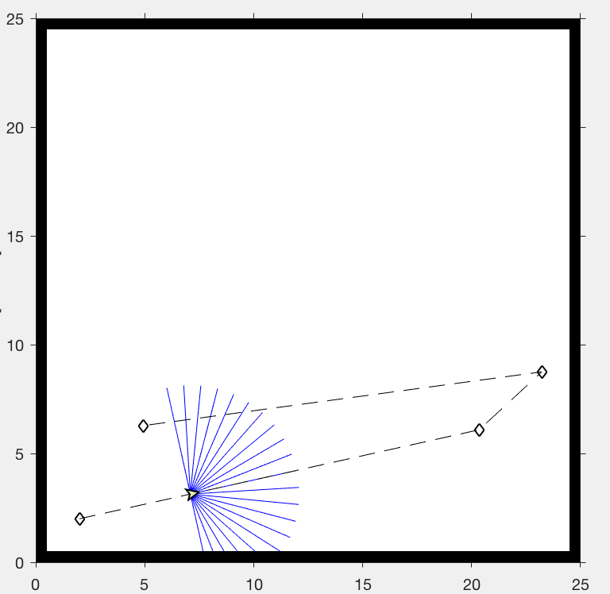
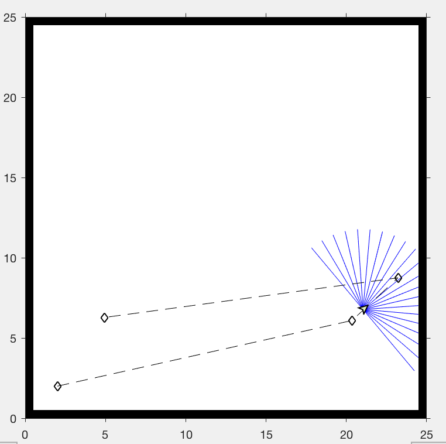
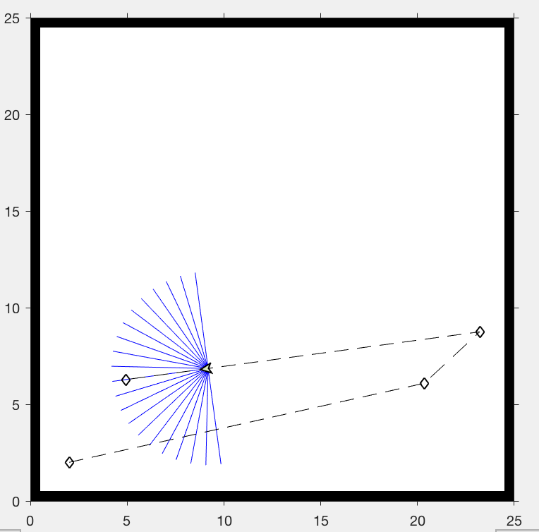
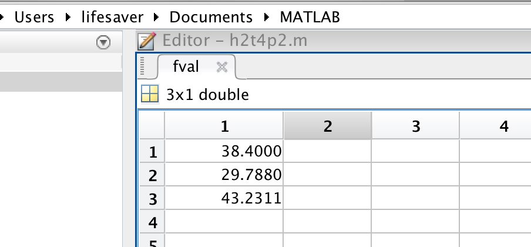

# Intelligent Robot Homework 2

#### 11510225 Yuxing Hu

---

### 1. If there are 100 lines in the grating, what is the smallest detectable change in motor-shaft angle?

360/(100*4) = 0.9 

---

### 2. Explain how to determine the rotation directions if the following encoders are used. List two concerns while choosing an encoder.

As we can see from the picture, there is a gap between Ch A and Ch B. And the result indicated that the Ch A will turn up first and then Ch B. So we know that the wheel will first comes to A which means the direction of rotation is depended by the location of A and B. If A is on the top of B, then the direction is counterclockwise, otherwise the direction is clockwise.

Concern 1: If the speed gets really fast then the encoder may not that accuracy to record the high voltage and the low voltage time and also if the speed is really high, the protection of the encoder divices is vital too.

Concern 2: The extra devices facing on the wheel will cost more time and money to do the cleaning work which is considered really heavy and tough. Cost will be high due to this equipment.

---

### 3. Simulate the process of mapping of a room by using a moving range sensor which knows its location accurately (randomly walking, or moving along a circle).

* Code for Question 3

```matlab
targetMap = ExampleHelperRobotSimulator('borderMap');
setRobotPose(targetMap, [2 2 -pi/2]);
enableROSInterface(targetMap, true);
scanSub = rossubscriber('scan');
[velPub, velMsg] = rospublisher('/mobile_base/commands/velocity');
tftree = rostf;
pause(1);
path = [25*rand(1), 25*rand(1);25*rand(1) 25*rand(1)...
 25*rand(1) 25*rand(1);25*rand(1) 25*rand(1)];
plot(path(:,1), path(:,2),'k--d');
controller = robotics.PurePursuit('Waypoints', path);
controller.DesiredLinearVelocity = 0.4;
controlRate = robotics.Rate(10);
goalRadius = 0.1;
robotCurrentLocation = path(1,:);
robotGoal = path(end,:);
distanceToGoal = norm(robotCurrentLocation - robotGoal);
map = robotics.OccupancyGrid(25,25,20);
updateCounter = 1;
while( distanceToGoal > goalRadius )
    scanMsg = receive(scanSub);
    pose = getTransform(tftree, 'map', 'robot_base', scanMsg.Header.Stamp, 'Timeout', 2);
    position = [pose.Transform.Translation.X, pose.Transform.Translation.Y];
    orientation =  quat2eul([pose.Transform.Rotation.W, pose.Transform.Rotation.X,...
     pose.Transform.Rotation.Y, ...
     pose.Transform.Rotation.Z], 'ZYX');
    robotPose = [position, orientation(1)];
    scan = lidarScan(scanMsg);
    ranges = scan.Ranges;
    ranges(isnan(ranges)) = targetMap.LaserSensor.MaxRange;
    modScan = lidarScan(ranges, scan.Angles);
    [v, w] = controller(robotPose);
    velMsg.Linear.X = v;
    velMsg.Angular.Z = w;
    send(velPub, velMsg);
    end
    updateCounter = updateCounter+1;
    distanceToGoal = norm(robotPose(1:2) - robotGoal);
    waitfor(controlRate);
end
```

The screenshot files are at the back of the pages.

---

### 4: Simulate the process of localization with GPS signals. When sender- receiver clocks are either synchronized or not synchronized, how many satellites are needed to achieve 3D accurate positions, respectively?

When it comes to synchronized situation, we only need three satellites because we don't need consider the time spend during the transition of satellite and the earth. And three satellites can give us three coordinates of the acutal place on earth.

However, in the real time calculation, three satellites are not enough because we must consider the time difference between the time satelliate calculate the length between itself and earth and the time after the massage is transfered. SO that means we need additional one satellite to comfirm the time.

* Code for Question 4

```matlab
h2t4p1(p,x,y,z,d)

h2t4p1 = [sqrt((x(1)-p(1))^2+(y(1)-p(2))^2+(z(1)-p(3))^2)-d(1)^2;
     sqrt((x(2)-p(1))^2+(y(2)-p(2))^2+(z(2)-p(3))^2)-d(2)^2;
     sqrt((x(3)-p(1))^2+(y(3)-p(2))^2+(z(3)-p(3))^2)-d(3)^2];

[p,fval] = fsolve(@(p) h2t4p1(p,x,y,z,d),[0,0,0]);
```


Appendix

* Question 3





* Question 4




