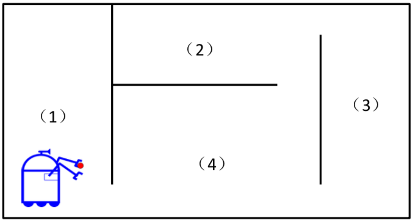
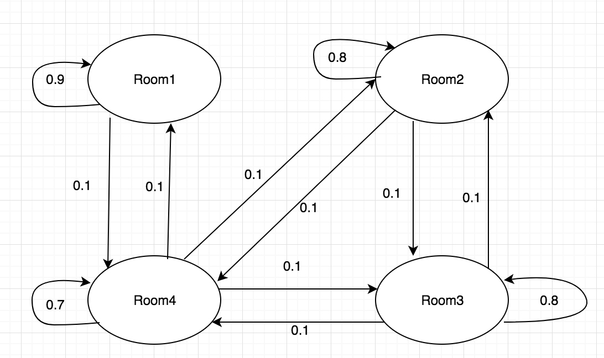

# Homework 3

### Yuxing Hu 11510225
 
 ---

### A robot cleaner is roaming within an apartment with four rooms. The map of the apartment is given as follows. The probability of the robot going through each door is 0.1. Please answer the following questions:

## (1) What is the Markov model for the robot roaming?

$$
 \begin{bmatrix}
   0.9 & 0 & 0 & 0.1 \\
   0 & 0.8 & 0.1 & 0.1 \\
   0 & 0.1 & 0.8 & 0.1 \\
   0.1 & 0.1 & 0.1 & 0.7 
  \end{bmatrix}
$$

The result is based on the number of entrances from each room to the others.

Also, the transform graph is shown below.

## (2) What is the probability of the robot staying at each room?

Suppose the initial position of robot in different room is 0.25, which can be presented as:

$$
 \begin{bmatrix}
   0.25 \\
   0.25  \\
   0.25 \\
   0.25
  \end{bmatrix}
$$

And then we let Markov model do the multiple operation with the vertex above, and can get that the answer is still 0.25. In fact, no matter where we put the robot into, after several iteration with Markov model, the answer stays the same, which is:

$$
P(at\ 1) = P(at\ 2)= P (at\ 3) = P(at\ 4) = 0.25
$$

## (3) What is the probability of the robot going through the door between (1) and (4) when the robot is going through a door?

$$\begin{split} 
P (through(1,4) | through\ door) 
= \frac {\sum P(all\ possibility\ of\ cross\ 1\ 4\ door)} {\sum P(all\ possible\ of\ cross\ door)} \\
= \frac {P(from\ 1\ to\ 4) * P(at\ room\ 1) + P(from\ 4\ to\ 1) * P(at\ room\ 4)} {\sum P(all\ possibility\ of\ cross\ door)}\\
= \frac {0.25 * 0.1+ 0.25*0.1} {0.25*(0.1)+0.25*(0.2)+0.25*(0.2)+0.25*(0.3)}\\
= \frac {1} {4} = 0.25
\end{split}$$

