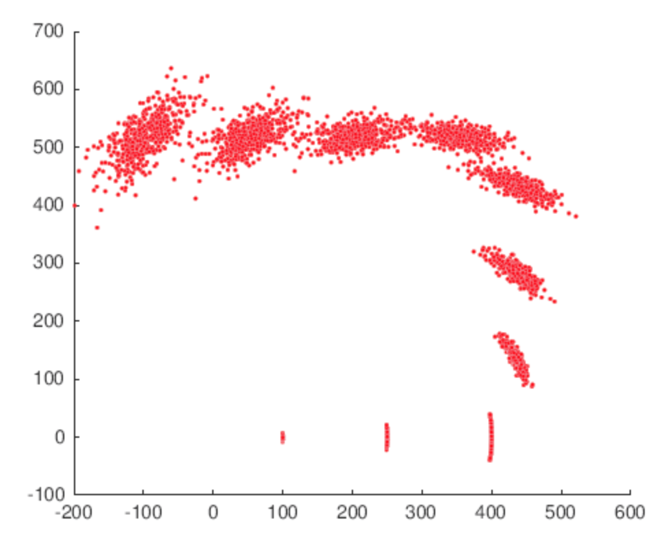
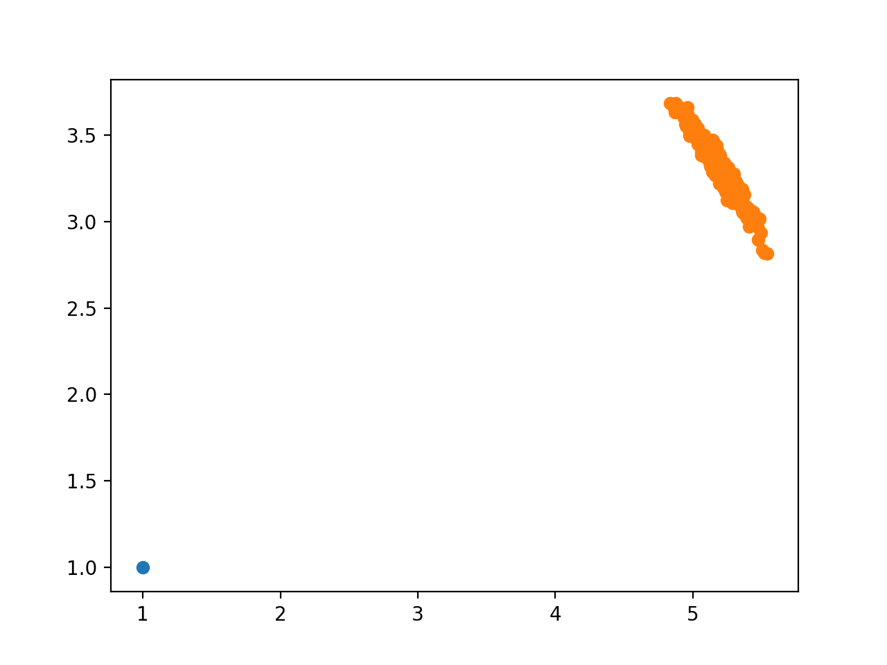
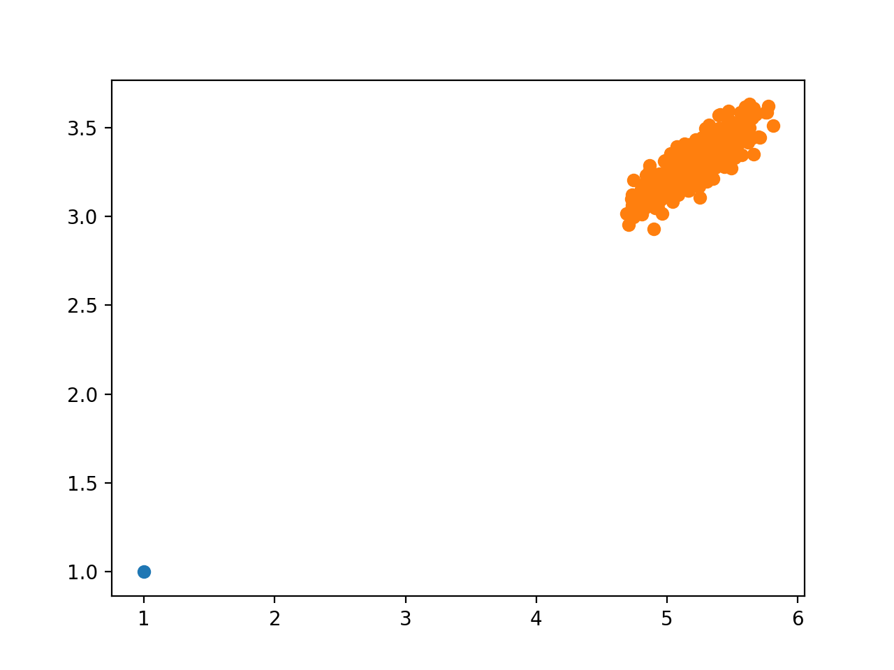
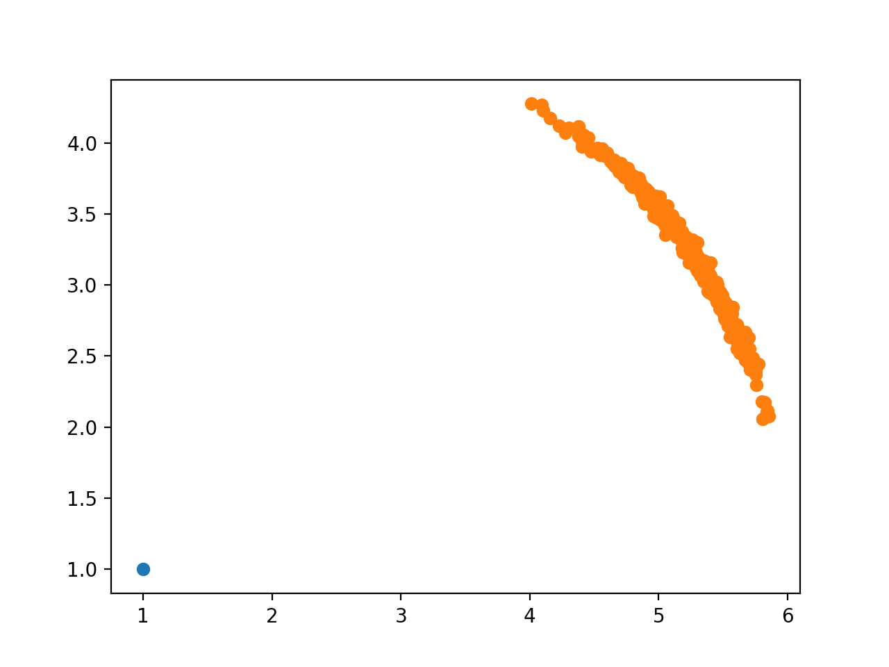
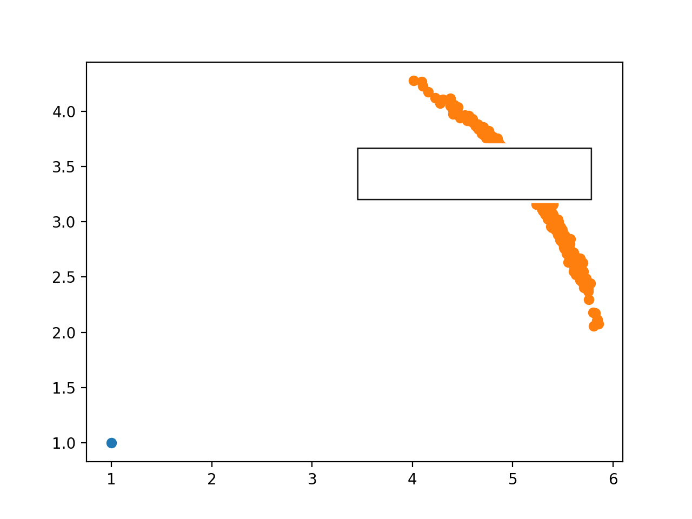

# Intelligence Robot Assignment#4

### 11510225 Yuxing Hu

---

## 1. Please generate samples of the odometry-based motion model (N=500).



```matlab

x = 100;y =100;theta = pi/4;
a1 = 0.000005;a2 = 0.000005;
a3 = 0.000005;a4 = 0.000005;
trajectory_data = zeros(3,500,30);
odom = zeros(3,30);
odom(:,:) = NaN;
odom(:,1:3)= 0;
trajectory_data(:,:,:) = NaN;
trajectory_data(:,:,1) = 0;
n = 1;t = 2;

while (t <= 30 )
    if t < 10
        delta_rot1 = 0;
        delta_trans =50;
        delta_rot2 = 0;
    elseif (t >= 10)&&(t < 12)
        delta_rot1 = 0;
        delta_trans = 50;
        delta_rot2 = pi/4;
        
    elseif (t >= 12)&&(t < 20)
        delta_rot1 = 0;
        delta_trans = 50;
        delta_rot2 = 0;

    elseif (t >= 20)&&(t < 22)
        delta_rot1 = 0;
        delta_trans = 50;
        delta_rot2 = pi/4;
        
    elseif (t >= 22)&&(t <= 30)
        delta_rot1 = 0;
        delta_trans = 50;
        delta_rot2 = 0;
    end


    for n = 1: 500
    delta_rot1_noise = delta_rot1 - normrnd(0,(a1*delta_rot1^2 + 
        2*delta_trans^2));
    delta_trans_noise = delta_trans - normrnd(0,(a3*delta_trans^2 + 
        a4*delta_rot1^2 + a4*delta_rot2^2));
    delta_rot2_noise = delta_rot2 - normrnd(0,(a1*delta_rot2^2 +
        a2*delta_trans^2));
    x = trajectory_data(1,n,t-1) + delta_trans_noise * cos(theta + 
        delta_rot1_noise);
    y = trajectory_data(2,n,t-1) + delta_trans_noise * sin(theta + 
        delta_rot1_noise);

    theta = trajectory_data(3,n,t-1) + delta_rot1_noise + delta_rot2_noise;
    trajectory_data(1,n,t) = x;
    trajectory_data(2,n,t) = y;
    trajectory_data(3,n,t) = theta;
    n = n + 1;
    end

    t = t + 1;
    if t < 10
        delta_rot1 = 0;
        delta_trans =50;
        delta_rot2 = 0;
        odom(1,t) = odom(1,t-1) + delta_trans;
        odom(2,t) = odom(2,t-1);
        odom(3,t) = odom(3,t-1) + delta_rot1 + delta_rot2;

    elseif (t >= 10)&&(t < 12)
        delta_rot1 = 0;
        delta_trans = 50;
        delta_rot2 = deg2rad(45);
        odom(1,t) = odom(1,t-1) + delta_trans * cos(theta + delta_rot1);
        odom(2,t) = odom(2,t-1) + delta_trans * sin(theta + delta_rot1);
        odom(3,t) = odom(3,t-1) + delta_rot1 + delta_rot2;
        
    elseif (t >= 12)&&(t < 20)
        delta_rot1 = 0;
        delta_trans = 50;
        delta_rot2 = 0;
        odom(1,t) = odom(1,t-1);
        odom(2,t) = odom(2,t-1) + delta_trans;
        odom(3,t) = odom(3,t-1) + delta_rot1 + delta_rot2;
        
    elseif (t >= 20)&&(t < 22)
        delta_rot1 = 0;
        delta_trans = 50;
        delta_rot2 = deg2rad(45);
        odom(1,t) = odom(1,t-1) + delta_trans * cos(theta + delta_rot1);
        odom(2,t) = odom(2,t-1) + delta_trans * sin(theta + delta_rot1);
        odom(3,t) = odom(3,t-1) + delta_rot1 + delta_rot2;
        
    elseif (t >= 22)&&(t <= 31)
        delta_rot1 = 0;
        delta_trans = 50;
        delta_rot2 = 0;
        odom(1,t) = odom(1,t-1) + delta_trans * cos(-pi);
        odom(2,t) = odom(2,t-1);
        odom(3,t) = odom(3,t-1) + delta_rot1 + delta_rot2;
    end
end
 

for m = 1:30
    if (mod(m,3) == 1) ||(mod(m,3) == 2)
    continue
    end
  scatter(trajectory_data(1,5:500,m),trajectory_data(2,5:500,m),'.','r');
  hold on
end
```

## 2. Please generate samples of the velocity-based motion model for following cases (N=500).

* Task 1



* Task 2



* Task 3



```python
    import random as ran
    import numpy as np
    import matplotlib.pyplot as plt

    def motion_model_velocity(u,x,a,d):
        new_v = u[0]+ran.gauss(0,a[0]*np.abs(v[0])+a[1]*np.abs(u[1]))
        new_w = u[1]+ran.gauss(0,a[2]*np.abs(v[0])+a[3]*np.abs(u[1]))
        new_g = ran.gauss(0,a[4]*np.abs(v[0])+a[5]*np.abs(u[1]))
        new_x = x[0]-new_v/new_w *np.sin(x[2]) +new_v/new_w*np.sin(x[2]+new_w+d)
        new_y = x[1]-new_v/new_w *np.cos(x[2]) +new_v/new_w*np.cos(x[2]+new_w+d)
        new_t = x[2]=new_w*d +new_g*d
        return [new_x,new_y,new_t]
        
    def staic_model_velocity(u,x,d):
        new_x = x[0]-u[0]/u[1]*np.sin(x[2])+u[0]/u[1]*np.sin(x[2]+u[1]*d)
        new_y = x[1]+u[0]/u[1]*np.cos(x[2])-u[0]/u[1]*np.cos(x[2]+u[1]*d)
        new_t = x[2]+u[1]*d
        return [new_x, new_y, new_t]

    def draw(u,x,a,d):
        t=1
        list_x = []
        list_y = []

        for i in range(500):
            temp = motion_model_velocity(u,x,a,d)
            list_x.append(temp[0])
            list_y.append(temp[1])
        d_temp = staic_model_velocity(u,x,a,d)
        s_temp = staic_model_velocity(u,x,a,d)
        plt.plot(list_x,list_y,'*')
        plt.plot(s_temp[0],s_temp[1],'*')
        plt.plot(x[0],x[1],'*')
        plt.show()

    if __name__ == '__main__':
        u = [15,15]
        v = [0, 0, 2*np.pi]
        # if task1
        # a = [0.03 0.03 0.01 0.01 0.01 0.01]; 
        # elif task2
        # a = [0.03 0.03 0.001 0.001 0.001 0.001]; 
        # else task3
        # a = [0.01 0.01 0.02 0.02 0.01 0.01]; 
        # then try this
        draw(u,v,a,0.5)
```

## 3. Please generate the map-consistent probability model in the following situation.



```python
    import random as ran
    import numpy as np
    import matplotlib.pyplot as plt

    def motion_model_velocity(u,x,a,d):
        new_v = u[0]+ran.gauss(0,a[0]*np.abs(v[0])+a[1]*np.abs(u[1]))
        new_w = u[1]+ran.gauss(0,a[2]*np.abs(v[0])+a[3]*np.abs(u[1]))
        new_g = ran.gauss(0,a[4]*np.abs(v[0])+a[5]*np.abs(u[1]))
        new_x = x[0]-new_v/new_w *np.sin(x[2]) +new_v/new_w*np.sin(x[2]+new_w+d)
        new_y = x[1]-new_v/new_w *np.cos(x[2]) +new_v/new_w*np.cos(x[2]+new_w+d)
        new_t = x[2]=new_w*d +new_g*d
        return [new_x,new_y,new_t]
        
    def staic_model_velocity(u,x,d):
        new_x = x[0]-u[0]/u[1]*np.sin(x[2])+u[0]/u[1]*np.sin(x[2]+u[1]*d)
        new_y = x[1]+u[0]/u[1]*np.cos(x[2])-u[0]/u[1]*np.cos(x[2]+u[1]*d)
        new_t = x[2]+u[1]*d
        return [new_x, new_y, new_t]

    def draw(u,x,a,d,x1,x2,y1,y2):
        t=1
        list_x = []
        list_y = []

        for i in range(500):
            temp = motion_model_velocity(u,x,a,d)
            if temp[0]>x1 and temp[0]<x2 and temp[1]>y1 and temp[1]<y2:
                continue
            list_x.append(temp[0])
            list_y.append(temp[1])
        d_temp = staic_model_velocity(u,x,a,d)
        s_temp = staic_model_velocity(u,x,a,d)
        plt.plot([x1, x1, x2, x2, x1], 
            [y2, y1, y1, y2, y2], 'black')
        plt.scatter(1, 1)
        plt.scatter(list_x, list_y)
        plt.show()

    if __name__ == '__main__':
        u = [15,15]
        v = [0, 0, 2*np.pi]
        x1 = 3.3
        x2 = 5.7
        y1 = 3.25
        y2 = 3.65
        # if task1
        # a = [0.03 0.03 0.01 0.01 0.01 0.01]; 
        # elif task2
        # a = [0.03 0.03 0.001 0.001 0.001 0.001]; 
        # else task3
        # a = [0.01 0.01 0.02 0.02 0.01 0.01]; 
        # then try this
        draw(u,v,a,0.5,x1,x2,y1,y2)
```

