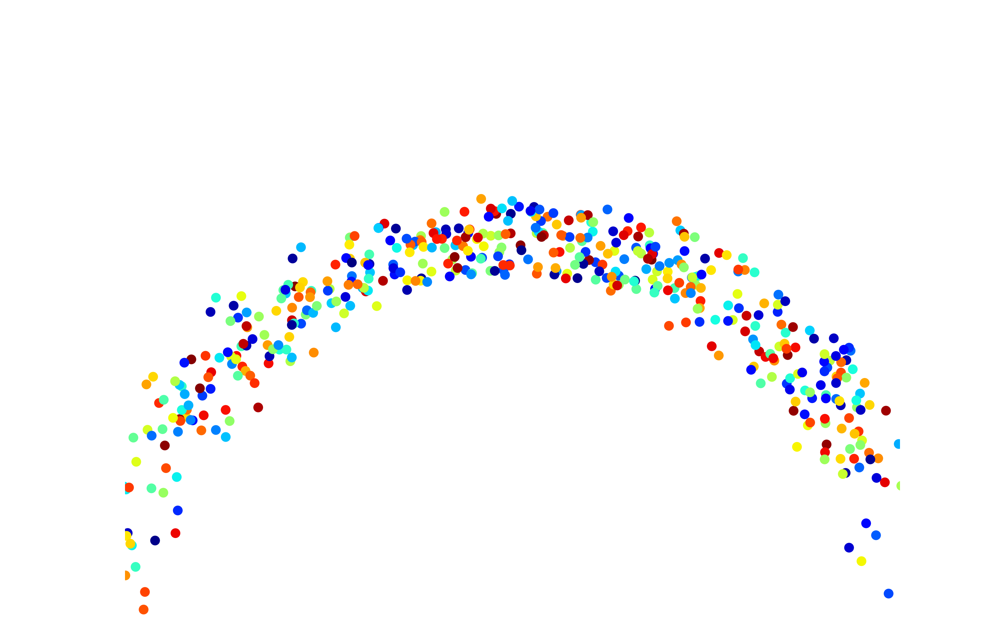
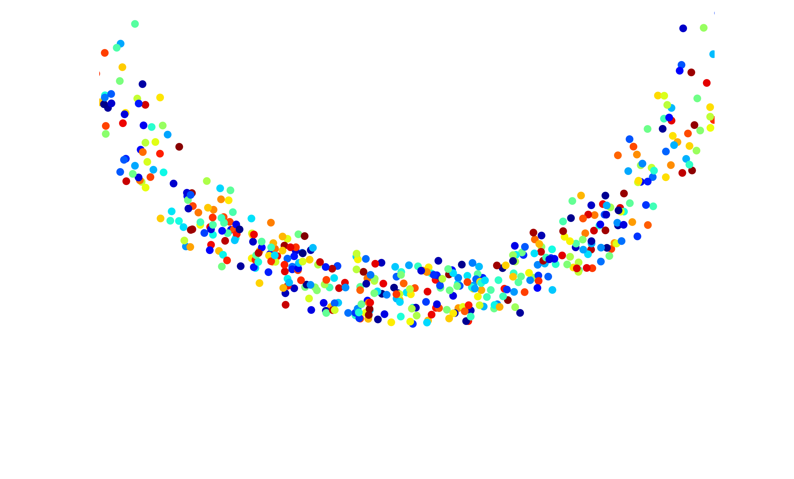
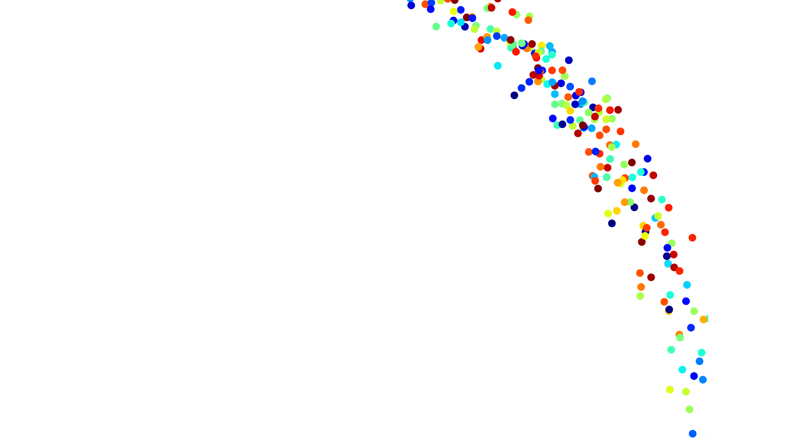
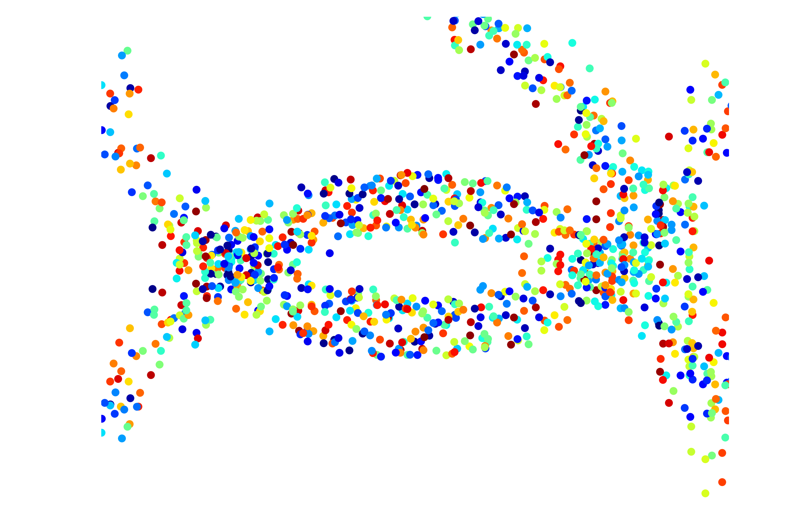
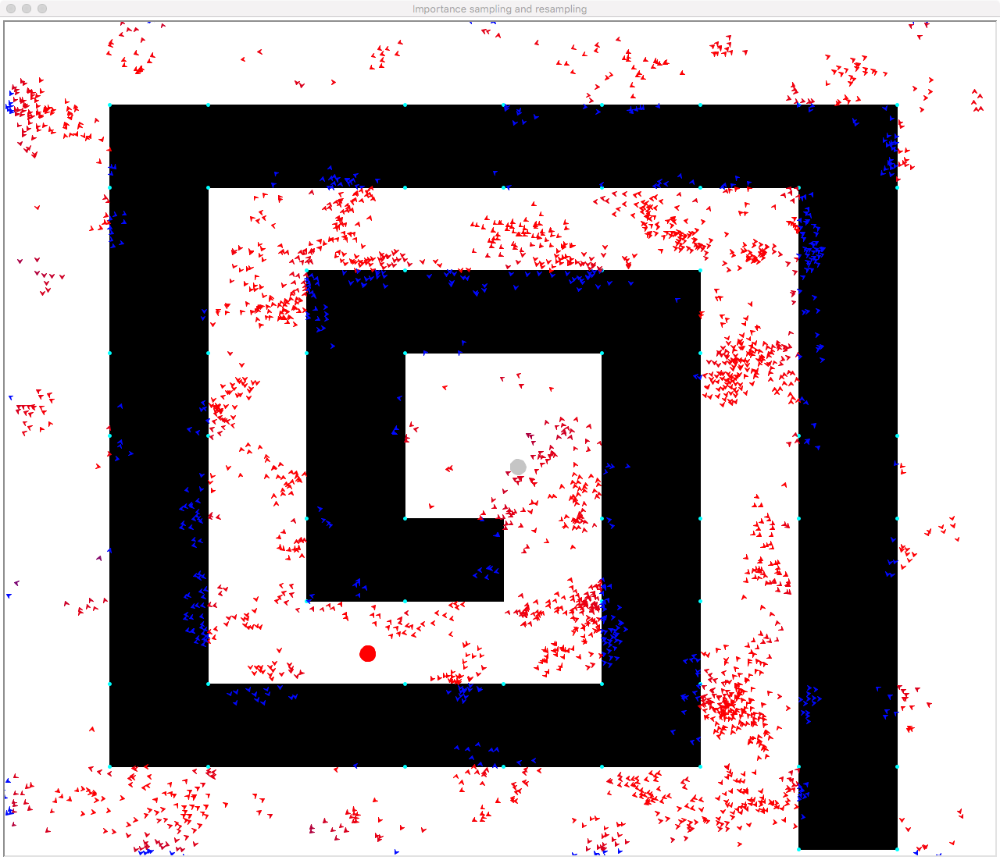
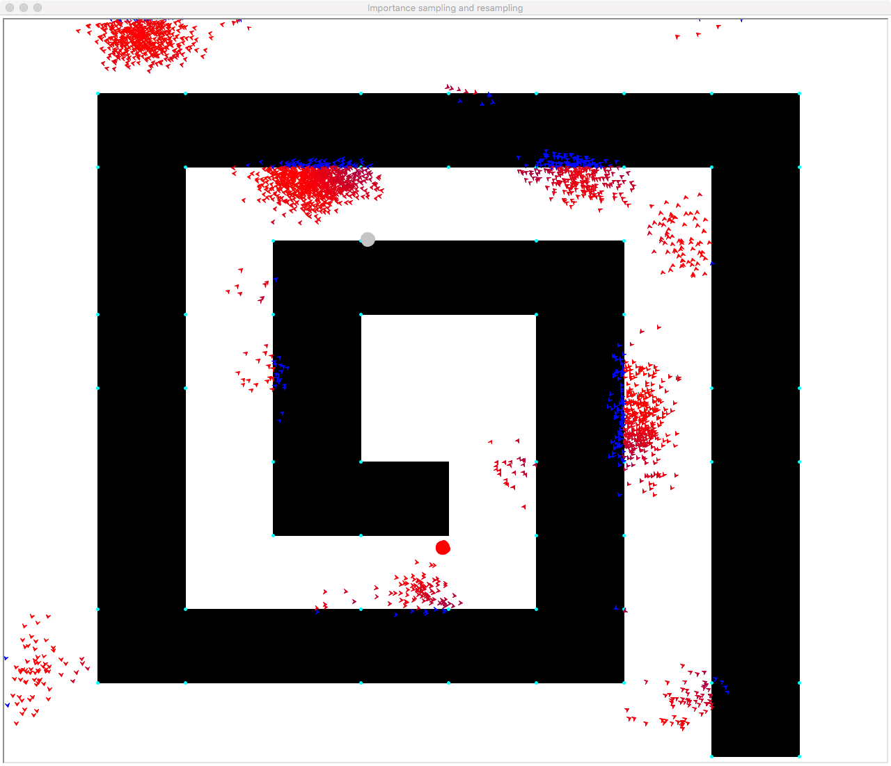
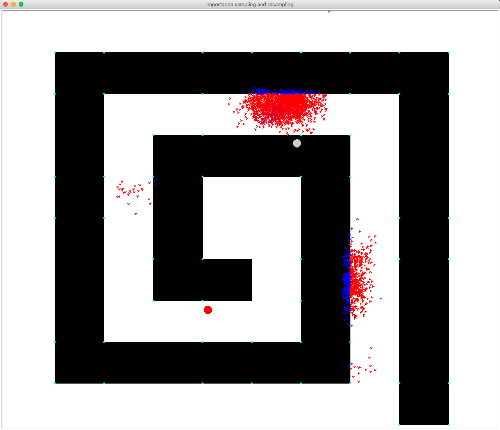
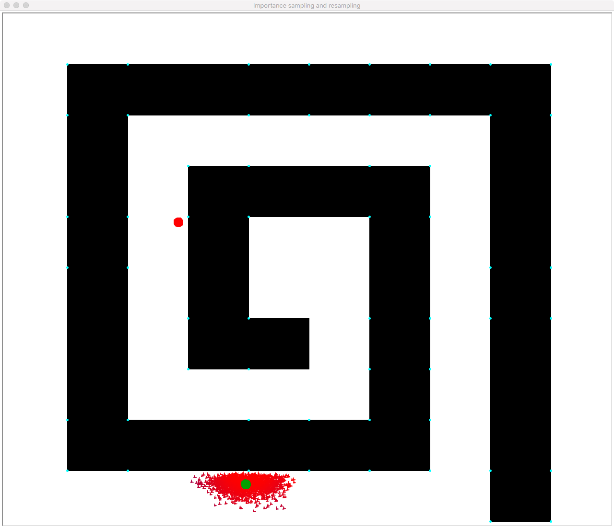

# Intelligence robot Assignment

### 11510225 Yuxing Hu

---

## Problem 1: Given the following observation models, please use importance sampling and resampling techniques to estimate the robot location

## Problem 2: Given a map and the ultrasound sensor model, please use importance sampling and resampling techniques to estimate the robot location and path

